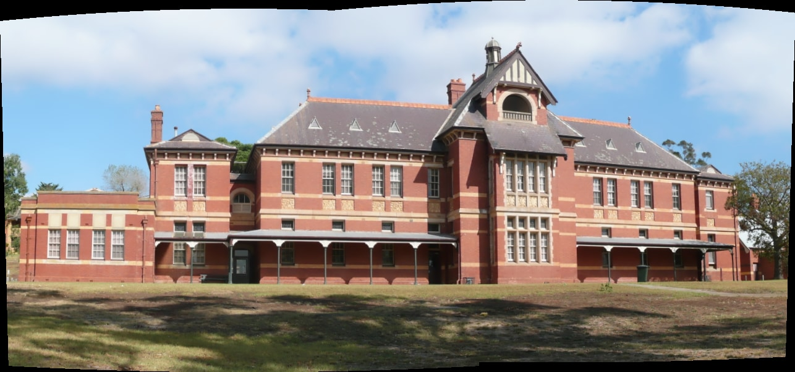

Project: panocv
Version: 0.20200405
Author : Siddhant Prakash

About:
------
The code given here is for simple image stitching of images using OpenCV.

I am using OpenCV 3.2.0.

Execution :
-----------

1) Compile the code using Makefile given, using the command:

     make

   It will create an executable panocv.

2) Run the executable by passing the image files as its arguements in the format:

     ./panocv <img_result> <img_file_1> <img_file_2> ...

   For example, to use the files in data1 directory use:

     ./panocv result.jpg sample/data1/panorama_image1.jpg sample/data1/panorama_image2.jpg

   The Resulting image is created and stored in the current directory with the name, "result.jpg" .

   

==================

2020

-- zvezdochiot --
